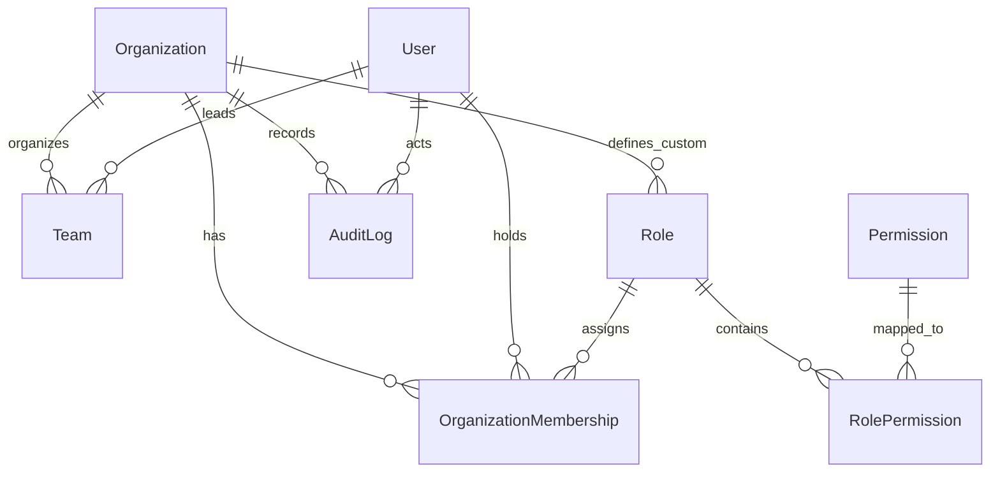

# Apex UAE Real Estate Platform — Architecture Blueprint

> **System Designation**: Dubai-focused Real Estate Sales Management & Supervision Platform  
> **Status**: Phase 1 Foundation Operational  
> **Target Audience**: Real estate master developers, private builders, property agencies, and sales operations leaders.

---

## 1. Executive Summary & Product Vision

The platform is designed to unify fragmented real estate sales operations across the United Arab Emirates. It replaces isolated tools (Excel sheets, WhatsApp threads, generic CRM software, manual daily sales logs, and disconnected inventory trackers) with a centralized, supervisory operating system.

The full platform lifecycle will eventually connect:
$$\text{Lead} \longrightarrow \text{Agent Assignment} \longrightarrow \text{Follow-up} \longrightarrow \text{Qualification} \longrightarrow \text{Site Visit} \longrightarrow \text{Negotiation} \longrightarrow \text{Booking} \longrightarrow \text{Unit} \longrightarrow \text{Closed/Lost} \longrightarrow \text{Supervision Reporting}$$

Phase 1 establishes the rock-solid technical bedrock: **Multi-tenant organization isolation**, **HTTP-only cookie authentication**, **hierarchical Role-Based Access Control (RBAC)**, **bespoke Dubai Real Estate design system**, **Application Shell**, **centralized error handling & validation**, and **relational database schema**.

---

## 2. Technology Stack

| Layer | Technology | Rationale |
| :--- | :--- | :--- |
| **Application Framework** | Next.js 15 (App Router) | Modern React 19 server components, unified API Route Handlers, edge-compatible middleware, zero cold-start routing. |
| **Language** | TypeScript (Strict Mode) | Strict typing across database models, API envelopes, RBAC rules, and form payloads. |
| **Styling & Design System** | Tailwind CSS + bespoke tokens | Dubai luxury B2B aesthetic: Obsidian `#0A0D15`, Desert Gold `#C59A56`, crisp platinum borders, tabular figures. |
| **Iconography** | Lucide React | Clean, scalable, accessible SVG iconography. |
| **Database & ORM** | Prisma ORM + SQLite (Dev) / PostgreSQL (Prod) | ACID-compliant relational schema, foreign keys, cascade deletes, type-safe queries, portable migration path. |
| **Authentication & Tokens** | HTTP-Only Session Cookies + `jose` (JWT) + `bcryptjs` | Zero vendor lock-in, offline/on-prem compatible, edge-verifiable, secure SameSite cookie defense. |
| **Validation Layer** | Zod | Runtime validation for all incoming requests, form data, TRN numbers, and tenant switches. |
| **Error Handling** | Custom `AppError` hierarchy | Normalized JSON envelopes (`ApiSuccessResponse<T>` and `ApiErrorResponse`), zero internal leak of server stack traces. |

---

## 3. Directory Structure

```
c:\Users\QUIKCARE COMPUTERS\OneDrive\Desktop\UAE Real Estate Project
├── app/
│   ├── (auth)/
│   │   ├── login/
│   │   │   └── page.tsx                 # High-end login page with demo credential presets
│   │   └── layout.tsx                   # Centered ambient luxury layout
│   ├── (dashboard)/
│   │   ├── dashboard/
│   │   │   └── page.tsx                 # Phase 1 Foundation supervision overview
│   │   ├── settings/
│   │   │   ├── page.tsx                 # Organization workspace profile & TRN configuration
│   │   │   ├── roles/
│   │   │   │   └── page.tsx             # RBAC roles & permissions explorer matrix
│   │   │   └── profile/
│   │   │       └── page.tsx             # User profile & organization memberships
│   │   └── layout.tsx                   # Authenticated AppShell wrapper with route guard
│   ├── api/
│   │   ├── auth/
│   │   │   ├── login/route.ts           # POST: Authenticate & issue HTTP-only cookie
│   │   │   ├── logout/route.ts          # POST: Clear session cookie
│   │   │   ├── me/route.ts              # GET: Active user, active org context & permissions
│   │   │   └── switch-org/route.ts      # POST: Switch active tenant organization context
│   │   ├── organizations/
│   │   │   └── [id]/route.ts            # GET/PATCH: Tenant-isolated org settings
│   │   └── rbac/
│   │       └── roles/route.ts           # GET: Inspect role definitions & permission matrix
│   ├── globals.css                      # Bespoke Dubai B2B theme tokens & tabular figures
│   ├── layout.tsx                       # Root layout with Inter font and AuthProvider
│   ├── error.tsx                        # Global Next.js error boundary
│   └── not-found.tsx                    # 404 page
├── components/
│   ├── layout/
│   │   ├── AppShell.tsx                 # Master responsive layout container (Desktop & Mobile)
│   │   ├── Sidebar.tsx                  # Collapsible navigation with upcoming phase indicators
│   │   ├── Topbar.tsx                   # Top navigation with currency badge & user nav
│   │   ├── WorkspaceSwitcher.tsx        # Multi-tenant organization switcher dropdown
│   │   └── UserNav.tsx                  # Profile menu, role badge, and sign out
│   └── ui/                              # 14 Handcrafted B2B UI primitives
│       ├── Button.tsx
│       ├── Input.tsx
│       ├── Select.tsx
│       ├── Card.tsx
│       ├── Table.tsx
│       ├── Badge.tsx
│       ├── Modal.tsx
│       ├── Dropdown.tsx
│       ├── Tabs.tsx
│       ├── Alert.tsx
│       ├── EmptyState.tsx
│       ├── LoadingState.tsx
│       ├── ErrorState.tsx
│       └── Breadcrumbs.tsx
├── features/
│   ├── auth/
│   │   ├── components/LoginForm.tsx     # Sign-in form with demo account quick-fill
│   │   ├── components/Can.tsx           # Declarative RBAC permission rendering component
│   │   └── context/AuthContext.tsx      # React context with login/logout/switchOrg/can
│   └── organization/
│       └── components/OrgSettingsForm.tsx # Workspace profile editor with TRN validation
├── lib/
│   ├── auth/
│   │   ├── passwords.ts                 # Bcryptjs hashing (10 salt rounds) & verification
│   │   └── session.ts                   # Jose JWT signing, verification, and cookie config
│   ├── db/
│   │   └── client.ts                    # PrismaClient singleton instance
│   ├── errors/
│   │   ├── app-error.ts                 # Typed error classes (ValidationError, TenantIsolationError, etc.)
│   │   └── handler.ts                   # Safe API response formatter & envelopes
│   ├── rbac/
│   │   ├── permissions.ts               # Wildcard & composite permission evaluation
│   │   └── guards.ts                    # Server-side requireAuth(), requireOrgMember(), requirePermission()
│   └── validation/
│       ├── schemas.ts                   # Zod schemas (Login, OrganizationUpdate, Profile)
│       └── validate.ts                  # Centralized validation runner
├── services/
│   ├── auth.service.ts                  # Authentication & session token management
│   ├── organization.service.ts          # Tenant retrieval, update, and overview stats
│   ├── user.service.ts                  # User profile and membership handling
│   └── rbac.service.ts                  # Roles and permissions catalog queries
├── database/
│   ├── schema.prisma                    # Complete Phase 1 database schema
│   └── seed.ts                          # Permissions, roles, demo orgs & demo users
├── types/
│   ├── api.ts                           # Unified API response contracts
│   ├── auth.ts                          # Authenticated user & session types
│   ├── organization.ts                  # Tenant summary & membership types
│   └── rbac.ts                          # Role definitions & system permission codes
├── config/
│   ├── site.ts                          # Site defaults (AED currency, Asia/Dubai timezone)
│   ├── navigation.ts                    # Navigation structure & future phase badges
│   └── permissions.ts                   # Complete catalog of 24 permissions & 7 system roles
├── tests/
│   ├── auth.test.ts                     # Password hashing, token, and schema tests
│   ├── rbac.test.ts                     # Permission evaluation & role matrix tests
│   ├── isolation.test.ts                # Cross-tenant boundary breach protection tests
│   └── run-all.ts                       # Test runner script
├── docs/
│   └── ARCHITECTURE.md                  # This document
├── middleware.ts                        # Route protection & edge session verification
├── tailwind.config.ts                   # Custom color palette & typography tokens
└── package.json                         # Project dependencies and scripts
```

---

## 4. Multi-Tenant Architecture & Data Isolation

The application enforces strict organization-scoped isolation:

```
Organization (e.g., "Emaar Properties PJSC")
  ├── Users (via OrganizationMembership)
  ├── Roles & Custom Permissions
  ├── Teams (e.g., "Downtown Sales Division")
  ├── AuditLogs
  └── (Future: Leads, Projects, Units, Bookings, Reports)
```

### Multi-Tenancy Principles
1. **No Shared Identifiers**: Every query against tenant data must filter by `organizationId`.
2. **Dual-Membership Support**: A single user (e.g., `owner@emaar.ae`) can be an `Owner` in Emaar Properties and an `Admin` in Damac Properties. The session encodes `currentOrgId` and `roleId`.
3. **Tenant Boundary Guards**:
   - `requireOrgMember(targetOrgId?)`: Verifies that the authenticated user actually holds an active membership in the target organization. If a user attempts to query another organization's records, `TenantIsolationError` (HTTP 403) is thrown immediately.
4. **Workspace Switching**:
   - The user can switch organizations seamlessly using `POST /api/auth/switch-org`.
   - The backend validates membership, issues a new signed JWT cookie, and switches context without re-authenticating.

---

## 5. Database Schema & Relationships



### Core Entities:
- **`Organization`**: Workspace anchor. Contains UAE TRN (Tax Registration Number), default currency (AED), timezone (`Asia/Dubai`), and status flags.
- **`User`**: Authentication identity. Holds corporate email, bcrypt password hash, name, and profile.
- **`OrganizationMembership`**: Bridge entity joining `User` to `Organization` with a specific `RoleId`. Unique constraint on `[organizationId, userId]`.
- **`Role`**: Represents a role (e.g., `owner`, `admin`, `sales_manager`, `agent`). Can be global (`isSystem = true`) or organization-specific.
- **`Permission`**: Granular capability string (e.g., `lead.view`, `lead.create`, `booking.manage`, `org.manage`).
- **`RolePermission`**: Join table binding `Role` and `Permission`.
- **`Team`**: Sales team hierarchy linked to `Organization` and led by a `User`.
- **`AuditLog`**: Security and operations audit trail for sensitive actions.

---

## 6. Authentication & Session Architecture

1. **Password Security**: Passwords are encrypted with `bcryptjs` using 10 salt rounds.
2. **Session Lifecycle**:
   - User submits `POST /api/auth/login` with email and password.
   - Credentials and organization membership are verified against the database.
   - A signed JWT token is generated containing `userId`, `email`, `currentOrgId`, and `roleId`.
   - The token is placed inside an `httpOnly`, `sameSite: "lax"`, `secure` (in production) cookie named `apex_uae_session`.
3. **Route Protection**:
   - `middleware.ts` intercepts all incoming requests to `/dashboard/*` and `/settings/*`.
   - If the cookie is absent or invalid, the request is redirected to `/login?from=...`.
   - If an authenticated user visits `/login`, they are redirected to `/dashboard`.

---

## 7. Role-Based Access Control (RBAC)

### Standard System Roles
1. **Owner / Master Developer (`owner`)**: Full authority over workspace, deletion, billing, and team structure (24 permissions).
2. **Administrator (`admin`)**: Operational administration across the entire organization except workspace deletion (23 permissions).
3. **Sales Manager (`sales_manager`)**: Supervises sales teams, assignments, projects, units, bookings, and reports (16 permissions).
4. **Sales Team Leader (`team_leader`)**: Oversees designated agents, follow-ups, inventory, and bookings (11 permissions).
5. **Real Estate Agent (`agent`)**: Frontline sales broker managing assigned investor leads, site visits, and booking tokens (8 permissions).
6. **Marketing (`marketing`)**: Lead generation campaigns, attribution, and analytics (6 permissions).
7. **Telecaller (`telecaller`)**: Outbound/inbound qualification calls (5 permissions).

### Wildcard Permission Evaluation
The permission engine supports module-level wildcards (e.g., `lead.*` covers `lead.view`, `lead.create`, `lead.edit`, `lead.delete`, `lead.assign`).

---

## 8. Error Handling & Validation Standards

### Unified API Responses
All API endpoints return one of two standardized response formats:

```ts
// Success (2xx)
{
  "success": true,
  "data": T,
  "message"?: string,
  "meta"?: { "page"?: number, "total"?: number }
}

// Error (4xx / 5xx)
{
  "success": false,
  "error": {
    "code": "VALIDATION_ERROR" | "AUTHENTICATION_FAILED" | "PERMISSION_DENIED" | "TENANT_ACCESS_DENIED" | "NOT_FOUND" | "INTERNAL_SERVER_ERROR",
    "message": string,
    "details"?: [ { "field": string, "message": string } ]
  }
}
```

### Security Rule
Internal database queries, exception stack traces, and environment details are logged exclusively on the server and never exposed in client API responses.

---

## 9. Environment Variables

| Variable | Description | Example / Default |
| :--- | :--- | :--- |
| `DATABASE_URL` | Prisma connection string | `file:./dev.db` (Dev) or `postgresql://...` (Prod) |
| `AUTH_SECRET` | 32+ char secret for JWT session signing | `apex_uae_real_estate_jwt_secret_key_...` |
| `NEXT_PUBLIC_APP_NAME` | Display brand name | `Apex UAE - Real Estate Supervision OS` |
| `NEXT_PUBLIC_DEFAULT_CURRENCY`| Default display currency | `AED` |
| `NEXT_PUBLIC_DEFAULT_TIMEZONE`| Operational timezone | `Asia/Dubai` |

---

## 10. Development & Testing Commands

```bash
# Install dependencies
npm install

# Generate Prisma client
npm run db:generate

# Synchronize database schema
npm run db:push

# Seed database with permissions, roles, and demo organizations
npm run db:seed

# Run Phase 1 automated test suite (Auth, RBAC, Tenant Isolation)
npm test

# Run TypeScript strict type-check
npm run type-check

# Compile production build
npm run build

# Start development server
npm run dev
```

---

## 11. Demo Accounts (Phase 1 Testing)

| Role | Email | Password | Primary Organization |
| :--- | :--- | :--- | :--- |
| **Owner** | `owner@emaar.ae` | `ApexDemo2026!` | Emaar Properties PJSC (also Admin in Damac) |
| **Sales Manager** | `manager@emaar.ae`| `ApexDemo2026!` | Emaar Properties PJSC |
| **Agent** | `agent@emaar.ae` | `ApexDemo2026!` | Emaar Properties PJSC |

---

## 12. Vercel Deployment Guidelines

When deploying to Vercel:

1. **Root Directory**:
   Ensure the Vercel project **Root Directory** points to the directory containing `package.json` and `app/`. If deploying from a repository with subfolders, set **Root Directory** in Vercel Project Settings accordingly.
2. **Build Command**:
   Standard default `npm run build` generates Prisma Client (`prisma generate --schema=database/schema.prisma`) and compiles Next.js (`next build`).
3. **Environment Variables on Vercel**:
   Add the following in Vercel Project Settings $\rightarrow$ Environment Variables:
   - `DATABASE_URL`: PostgreSQL connection string (or file-based storage if applicable)
   - `AUTH_SECRET`: 32+ character random secret string
   - `NEXT_PUBLIC_APP_NAME`: `Apex UAE - Real Estate Supervision OS`
   - `NEXT_PUBLIC_DEFAULT_CURRENCY`: `AED`
   - `NEXT_PUBLIC_DEFAULT_TIMEZONE`: `Asia/Dubai`

